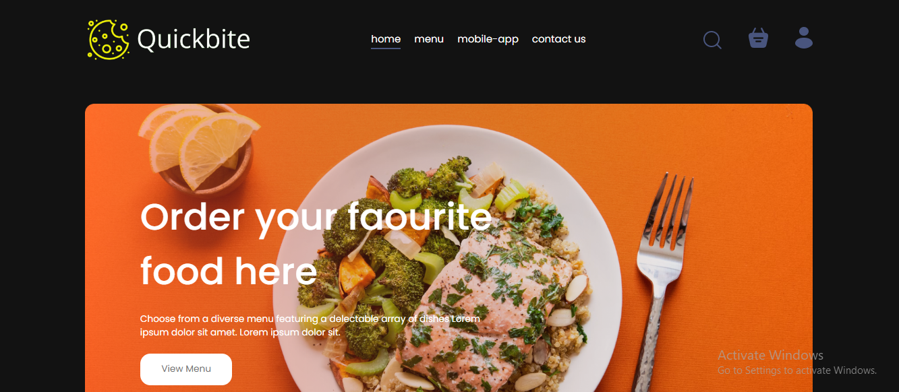
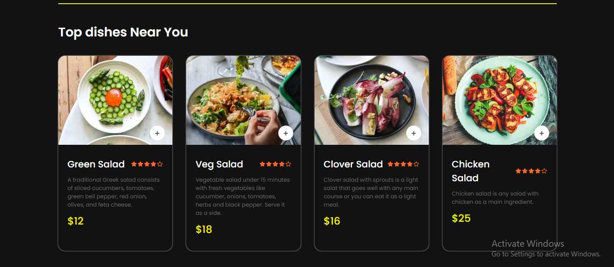
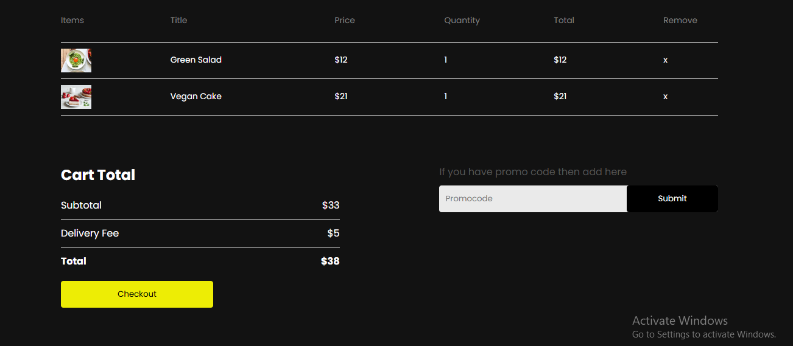
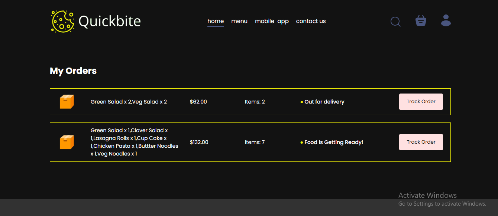
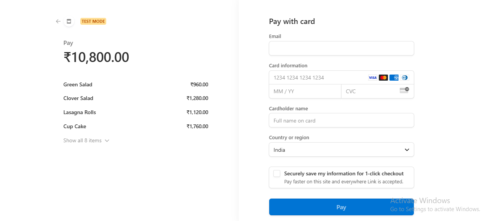
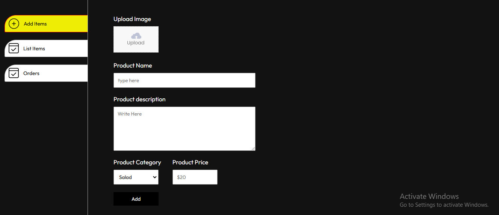
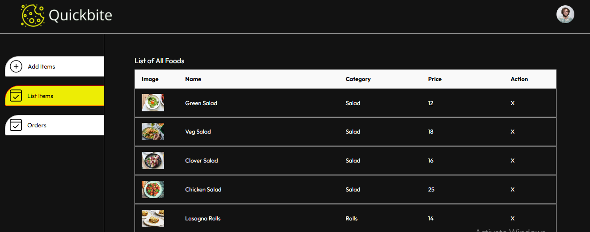
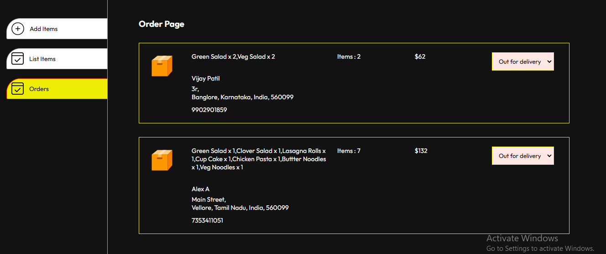

# QuickBite - Food Management System

**QuickBite** is a fully responsive web-based food management system designed to simplify online food ordering and management. It provides an intuitive user interface for customers to explore the menu, add items to the cart, view the total cost, and proceed to checkout with Stripe payment integration. On the administrative side, QuickBite allows administrators to manage the menu by adding, updating, and removing items, as well as tracking orders and updating order statuses efficiently.

**Tech Stack**:  
- **Frontend**: Vite + React
- **Backend**: Express.js, Node.js
- **Database**: MongoDB
- **Payment Gateway**: Stripe

## Features
- **User**: Browse the menu, add items to cart, view total, and checkout for payment.
- **Admin**: Add, remove, and list products; manage orders and update order status.
- Fully responsive interface adaptable to any device.

## Setup Instructions

### 1. Project Structure
This repository contains three main folders:
   - **Frontend**: Contains the user interface code.
   - **Backend**: Manages backend logic, including database operations and authentication.
   - **Admin**: Contains the admin interface.

### 2. Prerequisites
- **Node.js** and **npm** installed on your machine.
- **MongoDB** account with a configured cluster.
- **Stripe** account for payment functionality.

### 3. Steps to Clone and Run Locally

#### Step 1: Clone the Repository
```bash
git clone https://github.com/yourusername/QuickBite.git
```
Or download the zip file and extract it.

#### Step 2: Frontend Setup (User Interface)
1. Navigate to the `Frontend` folder:
   ```bash
   cd QuickBite/Frontend
   ```
2. Install dependencies:
   ```bash
   npm install
   ```
3. Start the development server:
   ```bash
   npm run dev
   ```
4. Open the localhost link from the console to view the frontend interface.

#### Step 3: Backend Setup
1. Configure MongoDB:
   - Create a MongoDB account and set up a cluster.
   - Obtain the MongoDB connection URI and add it to `db.js` in `Backend/config`.
2. Configure Environment Variables:
   - Create a `.env` file in the `Backend` folder and add the following keys:
     ```plaintext
     JWT_SECRET="random#secret"
     STRIPE_SECRET_KEY="your_stripe_secret_key"
     ```
3. Start the backend server:
   - In a new terminal, navigate to the `Backend` folder:
     ```bash
     cd QuickBite/Backend
     ```
   - Start the backend server:
     ```bash
     npm run server
     ```
   - The backend should be running on `localhost:4000`.

#### Step 4: Admin Interface Setup
1. In a new terminal, navigate to the `Admin` folder:
   ```bash
   cd QuickBite/Admin
   ```
2. Install dependencies:
   ```bash
   npm install
   ```
3. Start the admin development server:
   ```bash
   npm run dev
   ```
4. Access the admin interface via the localhost link in the console.

### 4. Screenshots
Here is a walkthrough of the "QuickBite" application with screenshots for key functionalities:

#### User Interface
- **Home Page**  
  

- **Menu**  
  

- **Cart View**  
  

- **My Orders**  
  

- **Stripe Payment**  
  

#### Admin Interface
- **Add Products**  
  

- **List Items**  
  

- **Orders View**  
  

"# bite" 
